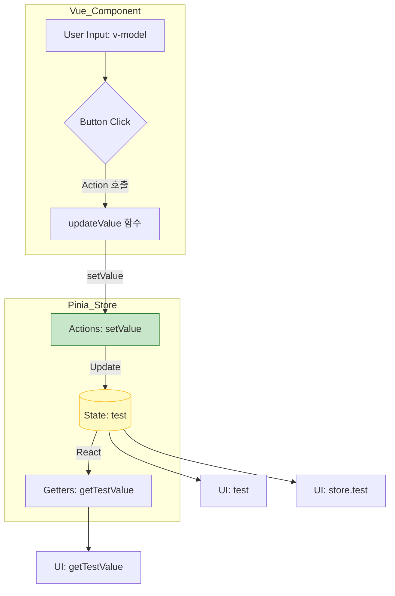

# 03_basic_pinia

## 사용한 라이브러리 및 플러그인

```bash
# 1. Pinia (데이터 중앙 처리)
yarn add pinia
# 또는
npm install pinia


# 2. pinia-persistedstate (스토어에 올라간 데이터가 새로고침 시 날아가는 현상을 방지하기 위해 추가하는 피니아 전용 플러그인)
yarn add pinia-plugin-persistedstate
# 또는
npm install pinia-plugin-persistedstate
```

### 관계도


